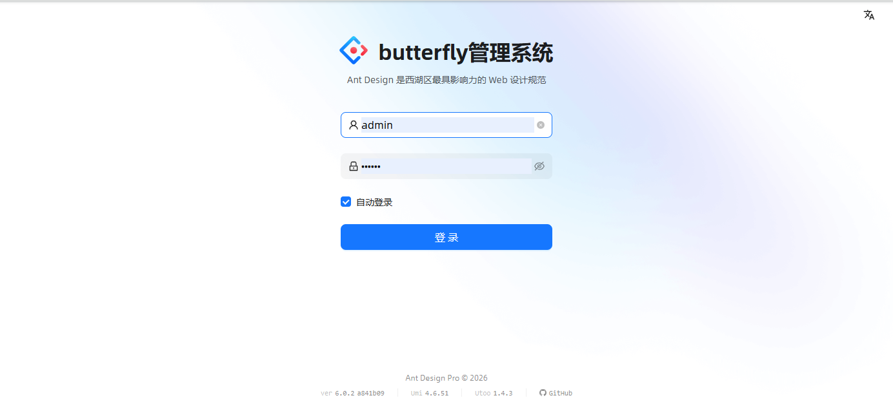
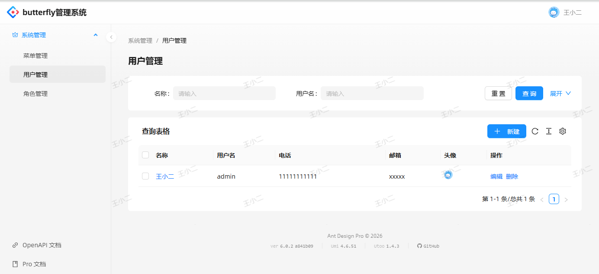
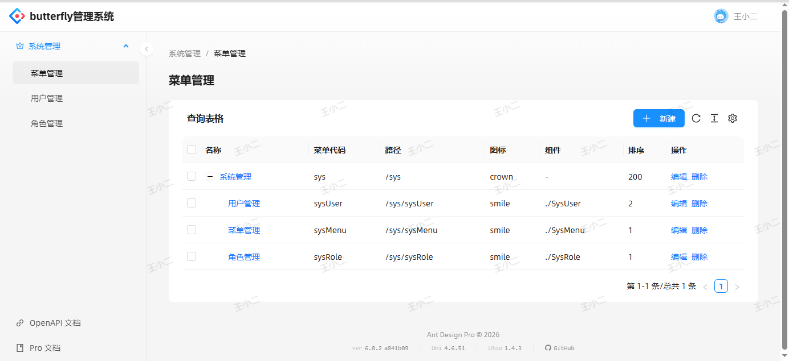
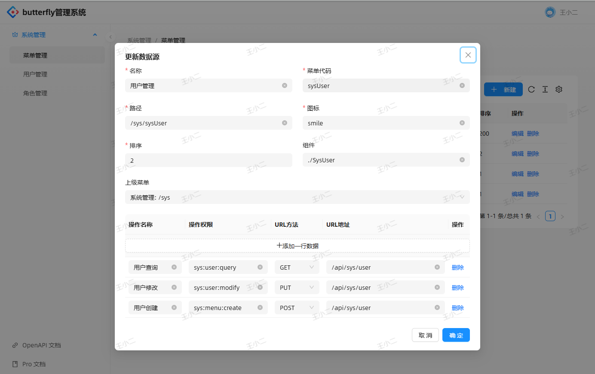

# Butterfly Admin

Go 语言后台管理系统，基于 Gin 框架和 GORM ORM，采用 DDD（领域驱动设计）架构风格。
提供用户认证、菜单管理、角色权限等功能。

## 相关项目

| 项目 | 说明 | 地址 |
|------|------|------|
| butterfly | 基础框架库（Gin 封装） | https://github.com/pwh19920920/butterfly |
| butterfly-admin | 后端 API 服务（本仓库） | https://github.com/pwh19920920/butterfly-admin |
| butterfly-admin-web | 前端管理界面 | https://github.com/pwh19920920/butterfly-admin-web |

## 界面预览

默认账号密码：admin/123456

### 登录



### 欢迎页


### 用户管理




### 角色管理


### 菜单管理





## 技术栈

- **语言**: Go 1.26
- **Web 框架**: Gin（via [butterfly](https://github.com/pwh19920920/butterfly) v1.1.6）
- **ORM**: GORM
- **数据库**: MySQL
- **认证**: JWT
- **配置管理**: Viper
- **ID 生成**: Snowflake

## 项目结构

```
butterfly-admin/
├── cmd/                         # 程序入口
│   └── main.go
├── internal/                    # 私有代码（internal 强制封装，禁止外部模块引用）
│   ├── starter/                 # 启动器与路由注册
│   ├── application/             # 应用层：服务编排
│   ├── interfaces/              # 接口层：HTTP handler
│   │   └── middleware/          # 中间件（JWT 认证）
│   ├── domain/                  # 领域层：核心业务
│   │   ├── entity/              # 领域实体
│   │   ├── repository/          # 仓库接口
│   │   └── security/            # 安全服务接口
│   ├── infrastructure/          # 基础设施层
│   │   ├── persistence/         # 仓库实现
│   │   └── security/            # 安全服务实现（JWT、加密）
│   ├── config/                  # 配置层
│   │   ├── auth/                # 权限配置
│   │   ├── database/            # 数据库连接
│   │   └── sequence/            # Snowflake ID 配置
│   ├── common/                  # 公共组件
│   │   └── constant/            # 常量
│   └── types/                   # 请求/响应类型定义
├── configs/                     # 运行时配置文件
│   └── config.yml
├── migrations/                  # 数据库脚本
│   └── butterfly_admin.sql
├── vendor/                      # 外部依赖（离线构建）
├── Makefile
├── Dockerfile
├── go.mod / go.sum
└── .gitignore
```

## 依赖方向

`cmd → internal/starter → {interfaces, application, infrastructure, config} → {domain, types, common}`，严格单向无环。

## 前置条件

- Go 1.26+
- MySQL

## 运行

> **重要**：配置文件 `configs/config.yml` 和日志目录 `logs/` 都是相对**进程工作目录（CWD）**读取的，不是相对二进制路径。因此所有运行方式都**必须在项目根目录**执行。

### 直接运行

```bash
# 在项目根目录执行
go run ./cmd
```

### 构建后运行

```bash
make build                     # 产出 bin/butterfly-admin
./bin/butterfly-admin          # 仍须在项目根目录执行
```

### 指定配置文件

框架支持 `--configFilePath` flag（默认 `configs/config.yml`）：

```bash
go run ./cmd --configFilePath=path/to/your-config.yml
```

## Makefile 常用目标

```bash
make build    # 构建到 bin/
make run      # go run
make vet      # go vet ./...
make fmt      # gofmt -s -w .
make tidy     # go mod tidy
make vendor   # go mod vendor
make docker   # 构建镜像
make clean    # 清理 bin/
```

## 配置文件

`configs/config.yml`：

```yaml
db:
  dsn: 'root:root@tcp(127.0.0.1:3306)/butterfly_admin?charset=utf8mb4&parseTime=True&loc=Local'

server:
  engineMode: 'release'      # gin 模式: debug/release
  serverAddr: :8088           # 服务端口
  methodOverride: true

auth:
  ignorePath:                # 完全忽略的路径
  ignorePrefixPath:           # 忽略认证前缀路径
    - GET - /api/sys/menu/refresh
  commonPath:                # 公共路径（需登录但无权限检查）
    - GET - /api/sys/menu/withOption
    - GET - /api/sys/role/all
    - GET - /api/sys/user/all
```

按 `engineMode` 命名的环境配置文件（如 `config-release.yml`）会被 viper 自动 merge，加载不到不影响启动。

## 数据库初始化

```bash
mysql -u root -p butterfly_admin < migrations/butterfly_admin.sql
```

## Docker

```bash
make docker
docker run -p 8088:8088 butterfly-admin
```

镜像内 `WORKDIR /app`，`configs/` 已打入 `/app/configs/`，默认即可命中配置文件；日志写入 `/app/logs`。

## API 路由

### 认证相关（无需 JWT）
- `POST /api/login` - 用户登录
- `POST /api/logout` - 用户登出
- `POST /api/refresh` - 刷新令牌
- `GET /api/currentUser` - 获取当前用户信息

### 菜单管理
- `GET /api/sys/menu/withOption` - 获取菜单及选项（公共）
- `GET /api/sys/menu/refresh` - 刷新菜单（忽略认证）

### 用户管理
- `GET /api/sys/user/all` - 获取所有用户（公共）

### 角色管理
- `GET /api/sys/role/all` - 获取所有角色（公共）

## 开发指南

### 添加新功能模块

1. 在 `internal/domain/entity/` 定义实体
2. 在 `internal/domain/repository/` 定义仓库接口
3. 在 `internal/infrastructure/persistence/` 实现仓库
4. 在 `internal/application/` 创建应用服务
5. 在 `internal/types/` 定义请求/响应类型
6. 在 `internal/interfaces/` 创建处理器并注册路由

### 核心实体

| 实体 | 表名 | 说明 |
|------|------|------|
| SysUser | t_sys_user | 用户信息 |
| SysMenu | t_sys_menu | 系统菜单 |
| SysRole | t_sys_role | 角色 |
| SysPermission | t_sys_permission | 权限 |
| SysToken | t_sys_token | 登录令牌 |
| SysMenuOption | t_sys_menu_option | 菜单选项 |

项目使用 GORM 自动迁移，实体表名遵循 `t_sys_*` 前缀规范。

### 代码规范

- 使用中文注释
- 遵循 Go 标准命名规范
- Handler 以 `*_handler.go` 命名
- Repository 以 `*_repository.go` 命名
- Application 以 `*_app.go` 命名
- Entity 使用 `t_sys_*` 表名前缀
